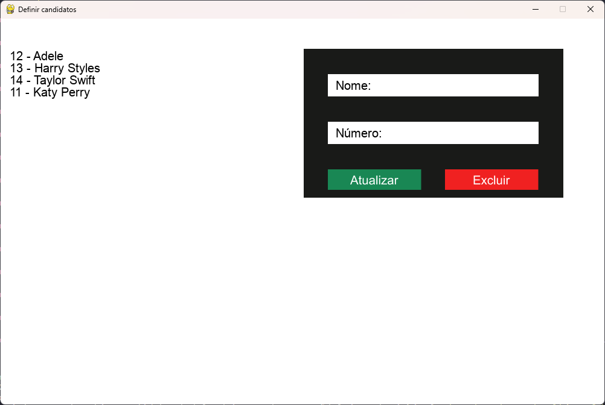
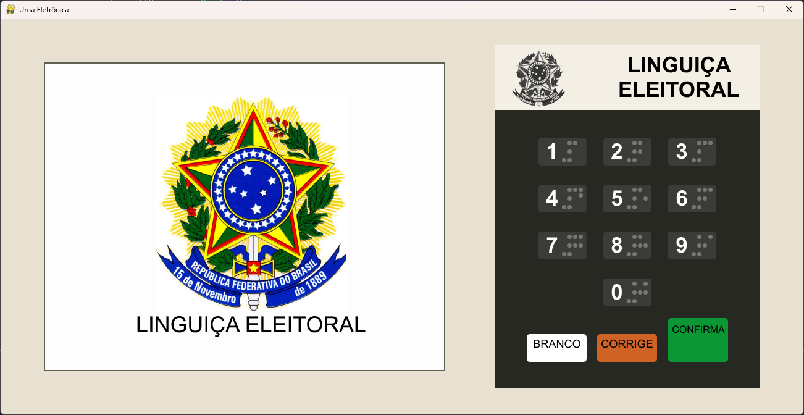
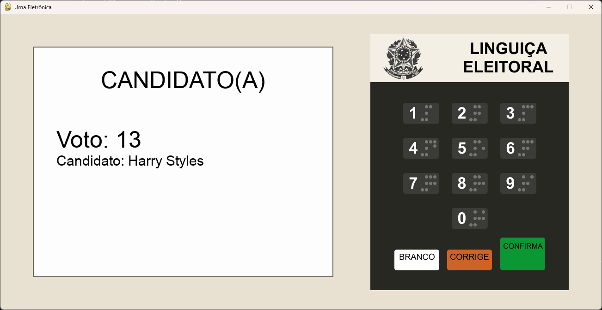
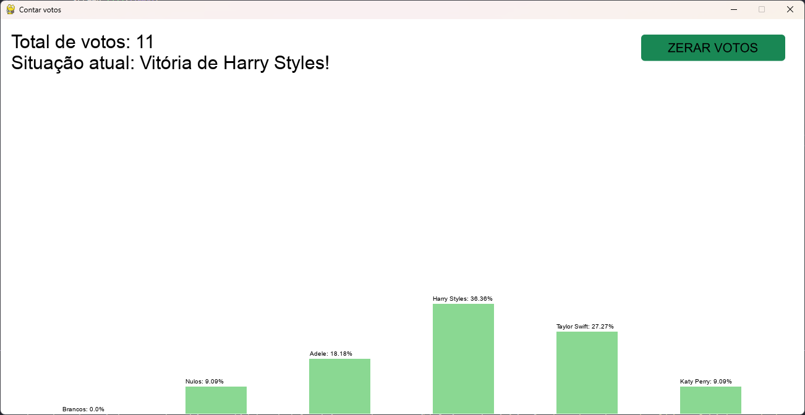

# Simulação de Urna Eletrônica

Este projeto simula o funcionamento de uma **Urna Eletrônica**, desenvolvido utilizando a biblioteca [Pygame](https://www.pygame.org/).

## 🖥️ Descrição Geral

A simulação conta com três arquivos principais:

1. **`definecandidato.py`**: Responsável pelo registro, edição e exclusão de candidatos.
2. **`Urna.py`**: Simula o funcionamento da urna, permitindo ao usuário votar e confirmar votos.
3. **`contavotos.py`**: Realiza a contagem de votos, exibe porcentagens de candidatos, votos nulos e brancos, e mostra o vencedor.

### Funcionalidades
- **Registro de Candidatos**: Defina os candidatos, incluindo nome e número, com a possibilidade de editar ou excluir.
- **Simulação de Votação**: Interface que exibe a logo "Linguiça eleitoral" até o usuário digitar o número do candidato.
- **Confirmação de Voto**: Exibe o nome do candidato ou informa se o voto é nulo. O voto em branco também é permitido.
- **Som da Urna**: Ao confirmar o voto, o mesmo som da urna eletrônica real é reproduzido.
- **Contabilização dos Votos**: Exibe a porcentagem de votos de cada candidato, incluindo nulos e brancos, e informa o vencedor, se houver.

## 🛠️ Como Executar a Simulação

1. Certifique-se de ter o [Python](https://www.python.org/downloads/) e o [Pygame](https://www.pygame.org/wiki/GettingStarted) instalados.
2. Clone este repositório:
   ```bash
   git clone https://github.com/gustakakkoii/urna_eletronica.git
   ```
3. Acesse o diretório do projeto:
   ```bash
   cd urna_eletronica
   ```
4. Execute cada arquivo conforme necessário:

- Para definir os candidatos:
  ```bash
  python definecandidato.py
  ```

- Para iniciar a urna:
  ```bash
  python Urna.py
  ```

- Para contar os votos:
  ```bash
  python contavotos.py
  ```

## 📚 Requisitos

- **Python 3.6+**
- **Pygame 2.0+**

Instale as dependências com:
```bash
pip install pygame
```

## 📋 Como Funciona

### `definecandidato.py`
- Permite adicionar novos candidatos inserindo o nome e o número correspondente.
- Candidatos já registrados podem ser editados ou excluídos.

##### Definindo Candidatos


### `Urna.py`
- Simula a interface da urna eletrônica.
- O usuário digita o número do candidato.
- Se o número for válido, o nome do candidato é exibido na tela.
- Se o número for inválido, o usuário é avisado que o voto é nulo.
- O voto em branco pode ser selecionado.
- O som da urna é reproduzido tanto ao digitar números quanto ao confirmar o voto.

##### Tela de Votação

##### Reconhecendo Voto


### `contavotos.py`
- Exibe a porcentagem de votos de cada candidato.
- Inclui a contagem de votos nulos e brancos.
- Exibe o vencedor (se houver) e possui um botão para zerar os votos.


##### Contagem de Votos


## Contribuições

Sinta-se à vontade para abrir issues ou enviar pull requests com sugestões de melhoria ou correções!

---

Desenvolvido por [Gustavo Almeida](https://github.com/gustakakkoii)
